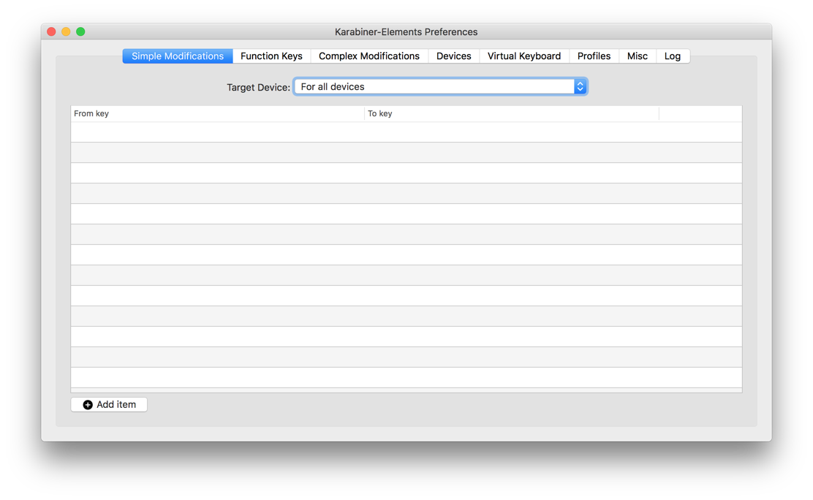
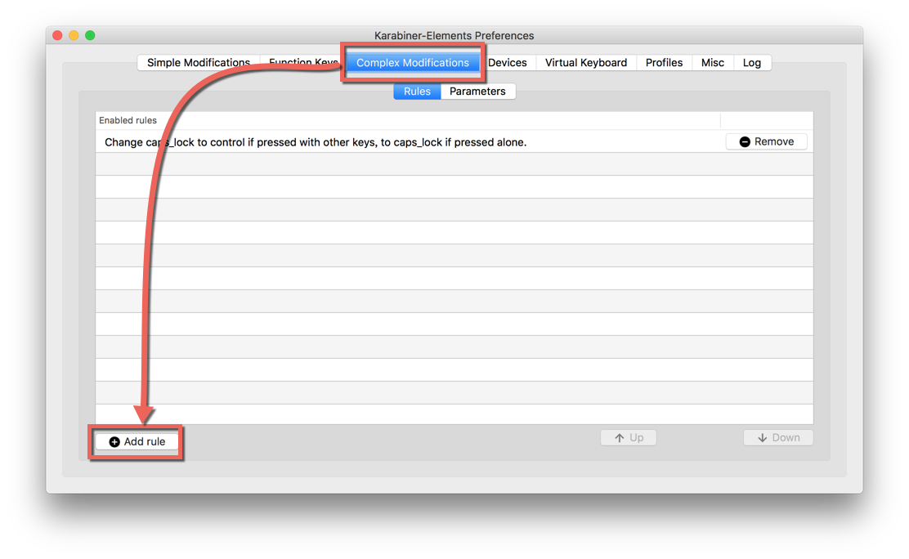
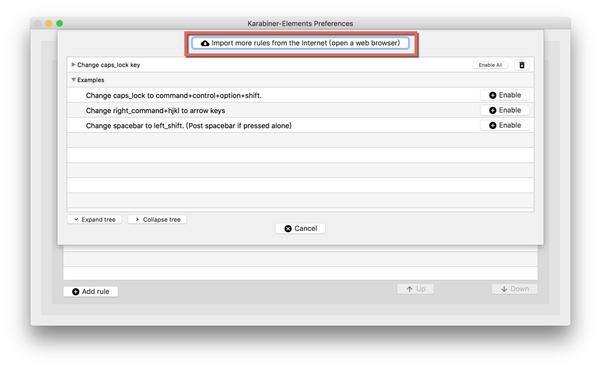
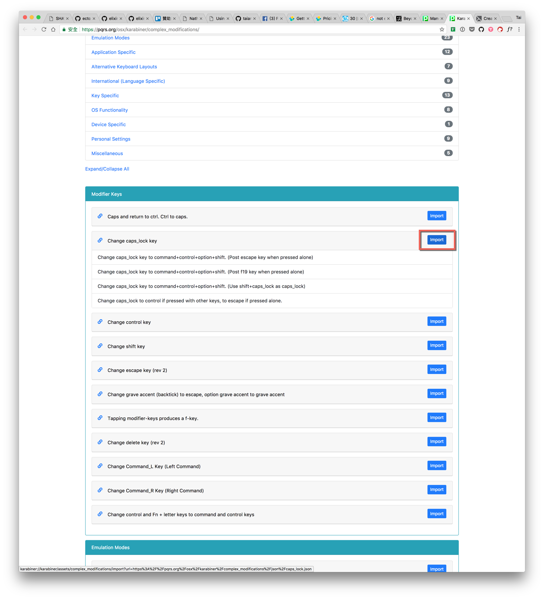
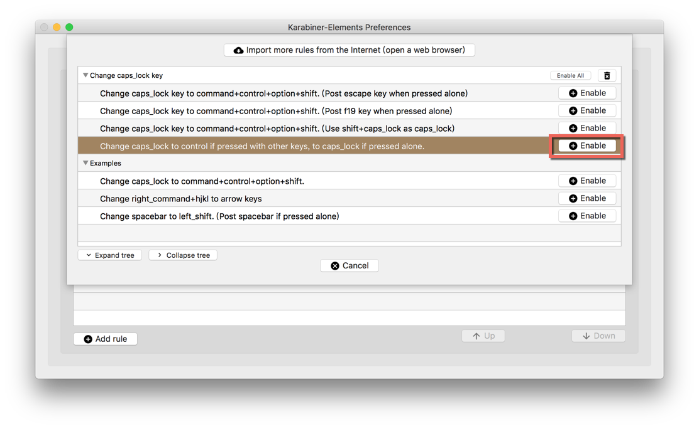
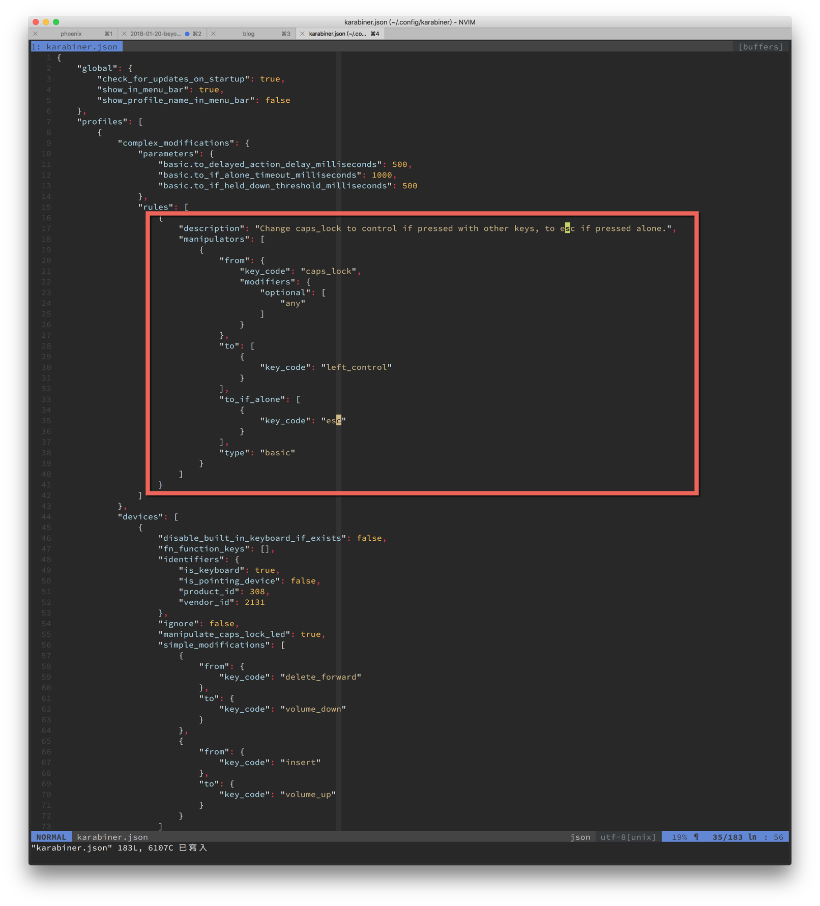
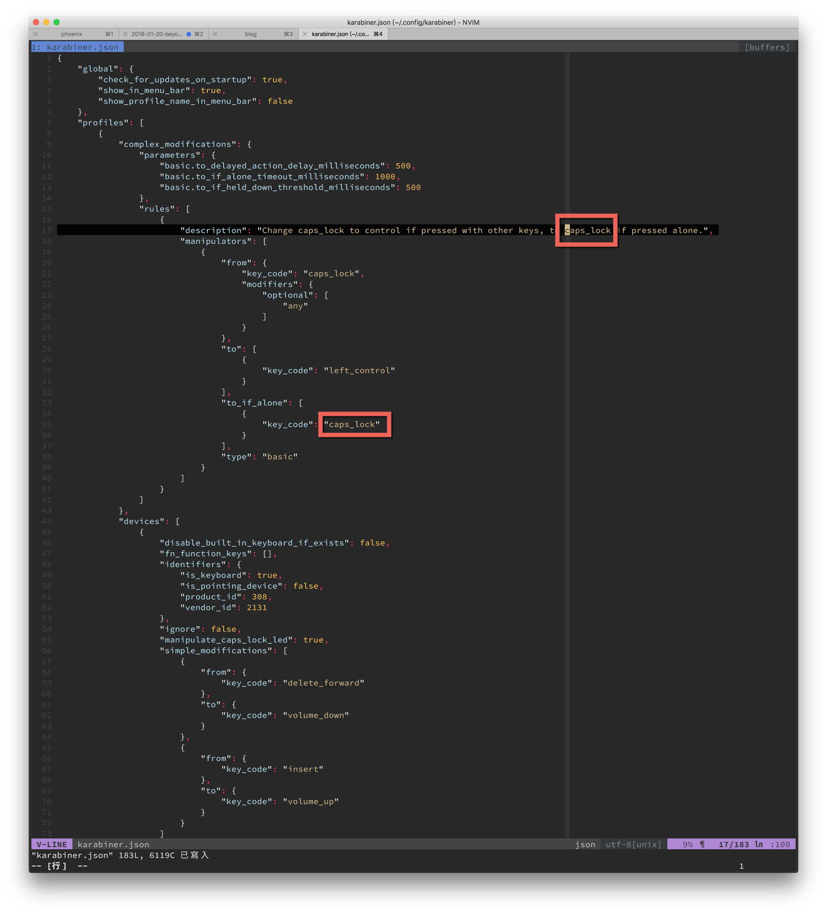

應該不只一次跟別人提起：「如果這幾年用 mac 有學到些什麼的話，最重要的一件事肯定是**把 Caps lock
改成 Ctrl**」。是的，Caps lock 這麼重要的位置，居然放了這麼無用的鍵。把它換成 Ctrl 會讓你的生活品質大大提升。

但是最近跟其它人推廣這個小技巧時，有時會得到這樣的反應：「但是我都用 Caps lock 來切換輸入法」。顯然 macOS 有想要改進這個無用的鍵，讓它多發揮一些功能。macOS 目前的設計是，如果你快速的按下 Caps lock 放開，那麼就會觸發**切換輸入法**的行為。如果你按久一點，那就是原先的 Caps lock。

讓我們來從行為模式來思考一下幾個情況：
1. Ctrl 是個綴詞鍵(或稱裝飾鍵)，當我們按下 Ctrl 時，必然是配合另一個鍵才會觸發我們想要的行為。
2. 切換輸入法則是一個鍵就可以觸發的行為。

所以如果我們可以做到這樣的事就完美了：
1. 當快速按下 Caps lock 並放開，觸發**切換輸入法**
2. 如果按著 Caps lock，並按下另一顆鍵，則視為 **Ctrl + key**

是的，這是辦得到的。但需要 [Karabiner](https://pqrs.org/osx/karabiner/) 這個免費軟體，並稍加修改。

 
1. 首先到 [https://pqrs.org/osx/karabiner/index.html](https://pqrs.org/osx/karabiner/index.html)
下載並依指示安裝，執行後會看到底下的畫面(記得要到**系統偏好設定 > 安全性與隱私權**打開相應的權限)：

  

2. 接著切換到 [Complex Modifications]，並按下左下角的 [Add rule]

  

3. 按下上方的 [import more rules from the Internet]

  

4. 這時瀏覽器會開啟，列入可以匯入的各種規則，找到 **Modify Keys** 區塊下的 **Change caps_lock
   key**，按下右邊的 [Import]

  

5. 回到 Karabiner 視窗，就可以看到多出一些可用的規則。找到 **Change caps_lock to control if pressed
   with other keys, to escape if pressed alone.**，按下右邊的 [Enable]。這個設定會在單獨按下時觸發
   [ESC]，而跟其它鍵一起按的時候變成 [Ctrl + key]

  

6. 雖然上面的設定也很不錯，但是我還是想要切換輸入法。這就要動用到編輯器了，用你喜歡的編輯器打開
   "~/.config/karabiner/karabiner.json"，找到我們匯入的規則區塊，也就是寫著 "description": "Change caps_lock to control..." 的那個 JSON object (花括號)。

  

7. 將底下的 "to_if_alone" 裡的 **key_code** 從 "esc" 改成 "caps_lock"，為了避免誤解，也順便將上方說明改成 "...to caps_lock if press alone."

  

8. 要切換輸入法，記得要在 macOS 的**系統偏好設定 > 鍵盤 > 輸入方式** ，將**使用大寫鎖定鍵來切換...** 核取方塊打勾

  

*Note:* 這個方式在切換到 macOS 內建的輸入法，如注音或是雙拼等都運作的很好。而我個人慣用的嘸蝦米，則是第一次要用 [Ctrl + Space] 切換到嘸蝦米之後，按下 [Ctrl] 可以輸入英文，再按一次回到嘸蝦米。不過右上角的輸入法則始終都會顯示嘸蝦米。

*Note2:* 我的系統有裝 Better touch tool，本來想用它來改，但目前似乎不提供這種功能。但 BTT 跟 Karabiner 一起運用目前都蠻正常的。

Happy hacking!
