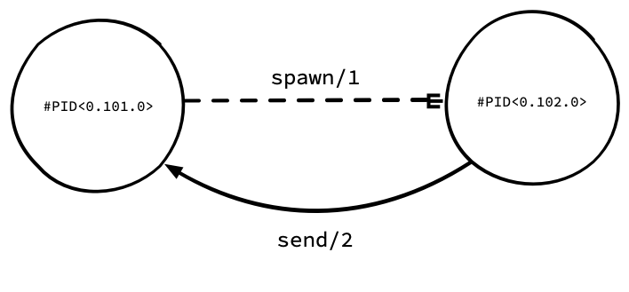
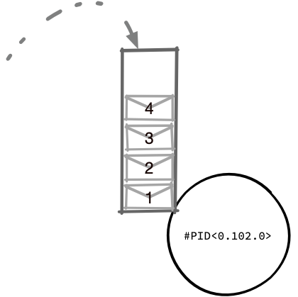
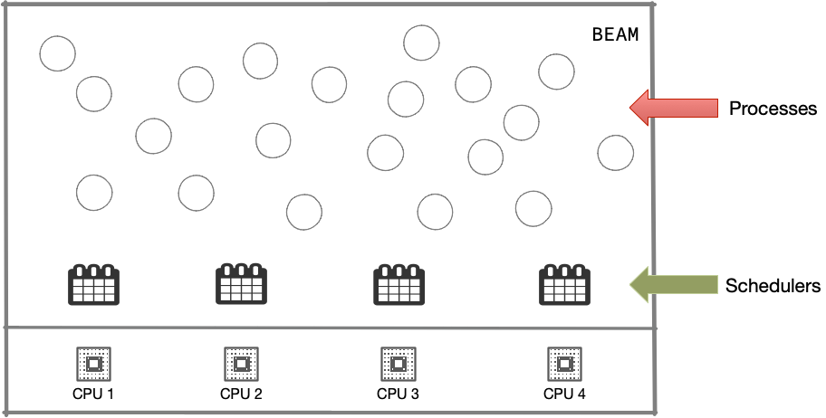

前陣子有幸可以亂入 [Functional Thursday 介紹 Elixir 及 Erlang](https://www.facebook.com/events/261681544537519/) 。Q&A 時穆老師問了個「有沒有 lock 機制」的問題，覺得那時沒有回答好，想說寫篇文章來說明。也希望藉此機會，試著逐篇記錄一下我目前對 Erlang /Elixir 中並行機制的理解。

先說結論，Actor model 在應用層不需要鎖，因為不論讀寫，訊息是**阻塞並依序處理的**。

## Actor model 概念

Erlang / Elixir 裡的並行機制是俗稱的 Actor model。在整個運行的系統裡，每個獨立執行的單位稱之為 Actor。各個 Actor 間不與其它人共享記憶體，而是透過互相傳遞訊息來得知其它 Actor 所持有的資訊。就像是一個房間裡有很多人，每個人都各自做自己的事，如果有某個人想知道另一個人的知識，那就要主動開口問他並等待回覆。

在 Erlang / Elixir 裡，整個運行系統 (BEAM 虛擬機) 裡，可以產生多個 light-weight process。這個 process 並非作業系統的 process，而是啟動耗時 1~3 µs 的輕量虛擬機 process。如果你寫過物件導向的語言，可以把它想像成類似 object instance 的東西。

## 前情提要：底層通訊機制 `spawn/1`、`send/2`

首先我們可以用 `spawn/1` 來生成一個 light-weight process (下稱 process)，傳入的參數是一個函數。`spawn/1` 的回傳值則是生成的 process 的 pid。而 process 間的溝通，則是用 `send/2` 帶上 `pid` 及要傳送的訊息。

例如我們可以讓新的 process 進行計算後，將結果傳給自己。由於 iex ( Elixir 的 repl ) 也是作為一個 process 啟動的，所以用 `self/0` 也可以拿到它的 pid，我們用它來試試訊息傳遞是怎麼一回事。

註：依 Elixir 慣例，`spawn/1` 代表名為 `spawn`， 接收**一個參數**的函式。其它依此類推。

```elixir
current_pid = self() # 拿到目前的 `pid`

pid =
  spawn(fn ->
    result = 1 + 1 # 做一些複雜的計算
    send(current_pid, result)
  end)

flush() # 將收到的訊息全部沖出來看 (iex 限定函式)
```

上例的圖示如下，我們在 iex 中，用 `self/0` 找到自己的 pid 為 0.101.0，用 `spawn/1` 生成一個新的 process，讓它在計算完成後，將結果用訊息送回 0.101.0。



到此為止是上次 meetup 時分享的內容。

## 用 `receive/1` 檢查信箱

每個 actor (也就是 process) 都分別有一個不與其它人共用的信箱，依**傳入時序**存放未處理的訊息。讀取訊息時，則是依 FIFO 的順序取出。大概像是這樣：



在 process 中要處理訊息時，會用 `receive/1` 來對收到的訊息進行 pattern matching。要注意的是一旦進入 `receive/1` 區塊，該 process 會**阻塞**並開始檢查信箱，直到比對到一筆符合的訊息，就調用該子句進行處理。

```elixir
current_pid = self() # 拿到目前 (iex) 的 `pid`

pid =
  spawn(fn ->
    receive do
      {caller, i} -> send(caller, i + 1)
    end
  end)

## 在 iex 裡操作生出來的 process
send(pid, {current_pid, 100})
Process.alve?(pid) # => process 死掉了 QoQ
flush() # => iex 收到 101 這條訊息
```

在上面我們看到 process 處理完訊息之後就陣亡了。那是因為**每個 `receive/1` 只處理一條訊息**，就結束區塊阻塞，往下執行。而 `spawn/1` 在函式調用結束後，就會終止該 process 了。

## 持續活著的 process

在上例中 receive/1 只執行(阻塞)一次，所以 process 在發送完訊息後生命週期就結束了。所以我們需要有個辦法讓它保持活著的狀態。我們先把參數用到的函式寫成具名函式，並將 `receive/1` 的區塊抽出來，這樣我們就可以遞迴的呼叫它。這麼一來這個 process 就能一直活著了。

```elixir
defmodule PingPong do
  def start do
    spawn(&loop/0) # 生成 process 並回傳
  end

  def loop do
    receive do
      {caller, :ping} -> send(caller, :pong)
      {caller, :pong} -> send(caller, :blah)
      :kabom -> exit(:normal) # 結束 process
    end

    loop() # 用遞迴讓這個 process 活下去
  end
end

## 在 iex 裡操作生出來的 process
pid = PingPong.start
send(pid, {self(), :ping})
Process.alive?(pid) # => true

send(pid, {self(), :pong})
Process.alive?(pid) # => true

send(pid, :kabom)
Process.alive?(pid) # => false

flush() # 可以看到回傳的兩條訊息
```

在上面的例子裡，當 `receive/1` 處理完一條訊息之後，我們就遞迴的呼叫 `loop/0` ，這樣就會啟動新一輪的 `receive/1` 來處理下一條訊息。我們可以看到在送出 `:kabom` 之前，該 process 一直是活著的。

## 帶著狀態的 process

在 BEAM 虛擬機裡，process 有自己的 heap 及 stack，不與其它人共享，再加上 Erlang / Elixir 的值是 immutable 的，我們便可以讓 process 運行時記住一組資料，慣例上稱之為 process 的 **state**。需要讀取或是更新這個 state 的其它人，都只能用送訊息給這個 process 的方式讀寫。這個 process 即是這個狀態的 **single source fo truth**。聽說費波納契是函數式編程的 101, 那我們就來做一個 FibCounter：

```elixir
defmodule FibCounter do
  def start do
    init_state = [0, 1] # 起始的 state
    spawn(fn -> loop(init_state) end)
  end

  def loop([first, second] = state) do
    next_state =
      receive do
        :next ->
          [second, first + second] ## 更新狀態
        {:get, caller} ->
          send(caller, first) ## 讀取狀態
          state # 保持一樣的 state
        :reset ->
          [0, 1]
        :kabom ->
          exit(:normal)
      end

    loop(next_state)
  end
end

## 在 iex 裡操作生出來的 process
counter = FibCounter.start
send(counter, :next)
send(counter, {:get, self()})
send(counter, :next)
send(counter, :next)
send(counter, :next)
send(counter, :next)
send(counter, {:get, self()})
send(counter, :reset)
send(counter, {:get, self()})
flush # => 拿到三條訊息，1, 5 跟 0
send(counter, :kabom)
```

應用程式裡我們可以到處傳遞 counter 這個 process，任何人都可以對它發送 `:next` 或是 `{:get, caller_pid}` 等訊息。

## 每次只處理一筆訊息

當 process 進入 `receive/1` 區塊時，會取出信箱中第一筆(最早的)訊息，依序比對各個 pattern matching 子句。若成功比對就開始進行處理。若該訊息不符合任何 block，則擱置該訊息，並比對信箱中的下一筆訊息。若沒有比對到符合的訊息，則會阻塞到下一條訊息進來為止。因此不需要手動鎖定什麼東西，Actor model 就能保證發送訊息的人總是拿到最新的狀態 (對送訊時刻而言)。

## 搶佔式調度

從微觀上來看，在接收到訊息之後，每個 process 會一直處在忙碌狀態中。那如果有 process 需要工作很長的時間，佔著 CPU 資源該怎麼辦呢？這時候就要從巨觀層面來看 Erlang 著名的**搶佔式調度**了。Erlang 在虛擬機上預設會為每個 CPU 核心配發一個 Scheduler，它會啟動一條 thread，並決定哪個 light-weight process 可以使用目前的 CPU 時間。scheduler 會為每個 process 計算函式調用的次數 (reduction) ，超過了使用次數，就會強制切換給另一個 process 工作，之後切換回來時再繼續未完成的部份。概略來說切換的頻率大約是數微秒一次。



這麼一來，就算系統中有 process 需要長時間的運算，也能保證其它的 process 依然可以取得 CPU 資源，將工作先執行完。


## 垃圾訊息

由於沒有比對到的訊息會被留在信箱裡，所以如果在信箱中堆積太多訊息時，會造成效能上的損耗。除了在環境參數或 process option 裡設定 `max_heap_size` 之外，你也可以在 `receive/1` 區塊中用子句來定期清理無效的訊息。

## OTP

在實務上，Erlang / Elixir 較少直接使用 `spawn/0`或 `send/2` 來產生 process 及傳遞訊息。而是使用 Erlang 包裝好的 OTP (open telecom platform) 工具，例如 `GenServer` 、`Supervisor` 來建構系統。這部份就是下一篇的內容了 (如果有的話)。

## 許願

話說希望之後有機會可以再去 Functional Thursday 發表**Haskell 相關**的主題。 XD
