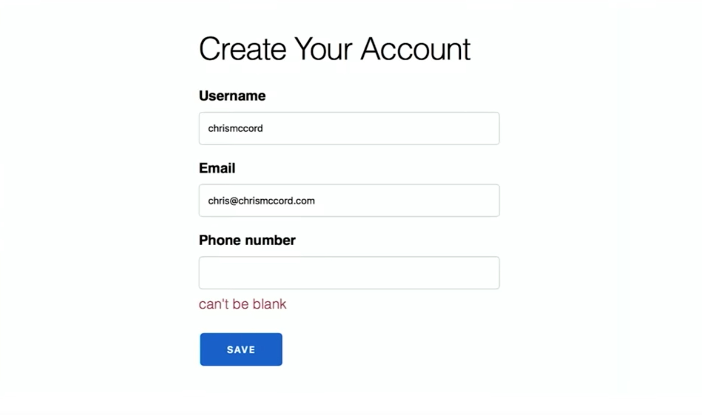
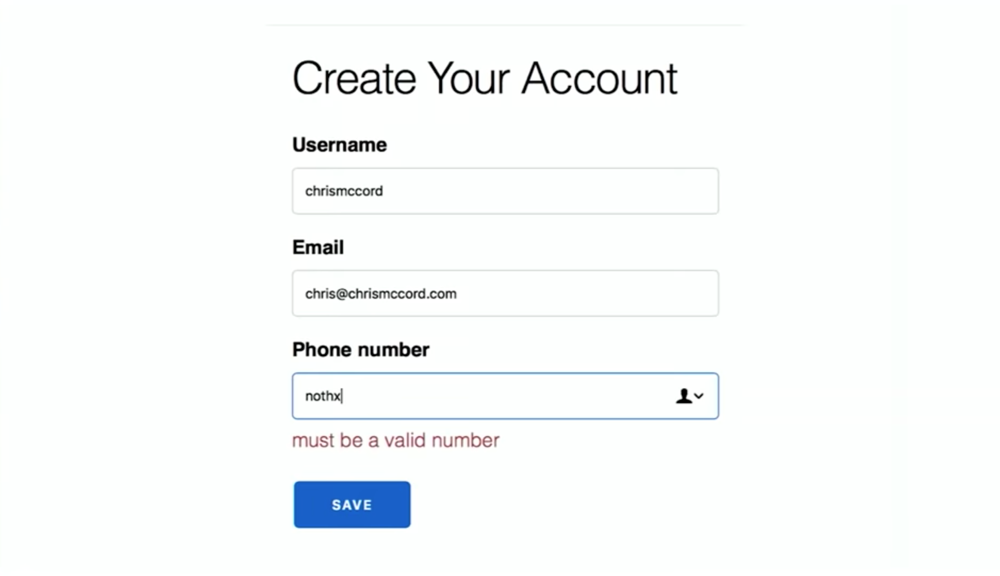
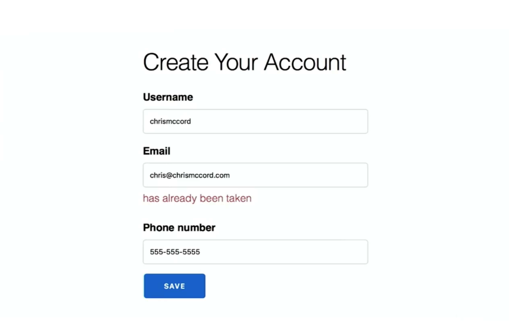
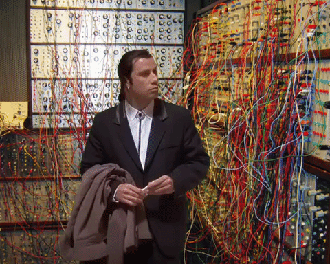
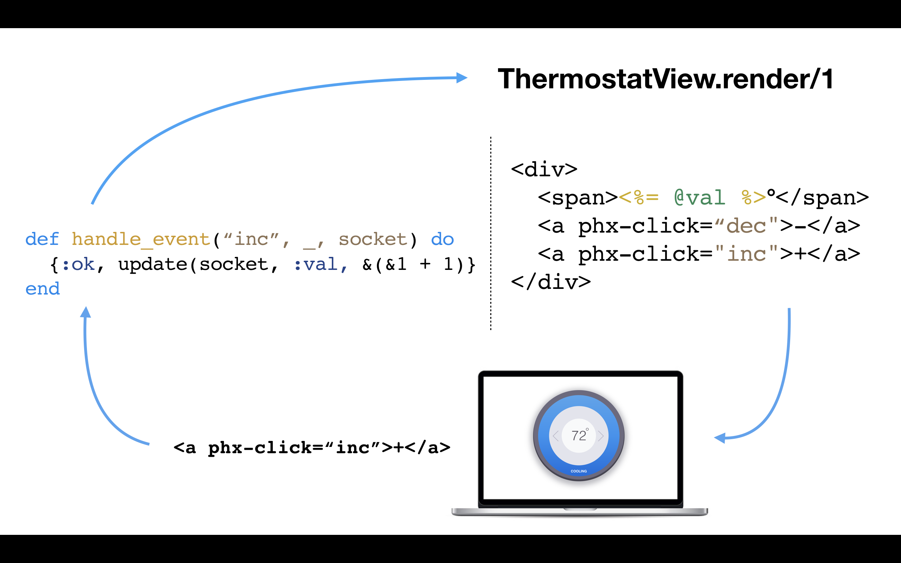
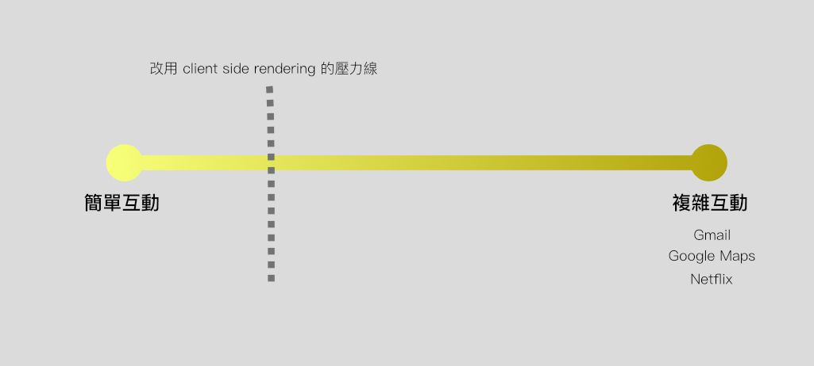

在 2018 九月 [ElixirConf](https://elixirconf.com/) 的 ending keynote 中，Phoenix 的作者 Chris McCord 發表了正在開發中的新套件，Phoenix LiveView。而上週五 (3 月 15 日) 這個套件終於在  GitHub 上[公開](https://github.com/phoenixframework/phoenix_live_view)了。 本篇將介紹 Phoenix LiveView 的想解決的問題、基本概念，以及一些個人的想法。

## 簡單場景：Server side render

在介紹 Phoenix LiveView 之前，先來回頭看一個用 server side render 寫出來的表單輸入場景：註冊帳號。首先使用者輸入 username 及 email，按下送出。發現註冊失敗，原來電話號碼是必填欄位。

接著亂填一個電話號碼，按下送出，錯誤訊息提示電話號碼格式不對。

把電話號碼改好後，按下送出，才發現這個 email 已經被註冊過了。

換了一個 email 按下送出，這次才終於註冊成功。只有三個欄位的表單，使用者按下了四次送出鈕才完成。

## 下一步：用 JavaScript 改進

我們想要的是當按下鍵盤按鍵時，就幫我們判斷格式是否正確，欄位是否有填完等等。為了改善這糟糕的互動體驗，主流的做法是引進 JavaScript 。通常會先以原生的 JavaScript ，或許再配上一點 jQuery 用 AJAX 來處理，接著依場景在前端實作將各種欄位的驗證及錯誤提示，當然後端的驗證還是要保留著。不然就會發生前沒多久某屈姓藥妝店的新聞了。

但隨著功能變多，沒有仔細規劃的話，我們的網頁就逐漸變成了一鍋「事件湯」。各個 listen events 間有錯綜複雜的觸發順序與依賴關係，一不小心就會讓該發生的事沒觸發到，或是不該發生的事件觸發了。

  

這時就會開始考慮使用 JavaScript 框架。但撇開漫長的工具棧選擇及組織社會性問題，各個頁面流程都得逐漸遷移到前端去。再來就發現頁面的 SEO 沒了，如果很在乎 SEO 的話，那就得在中間做一層 isomorphic layer，讓爬蟲也能爬到資料…

即使天時地利人和，總算把整個站改成了 Single Page Application 加上原本的後端的 Server。此時後端的 Server 已經變成一個純 API Server 了，那麼就會開始懷疑後端 Server 的實作方式是否符合目前架構的特性。舉例來說，為什麼要用 Rails 做純 API Server 呢？是不是改成 Sinatra ，甚至用 Golang 會比較好？

# Phoenix LiveView

在許多情況下，我們只是想要一些些比較好的使用者互動而己。

可不可以沿用後端的頁面流程及驗證邏輯，卻又能即時的跟使用者互動呢？ Phoenix LiveView 就是在這個概念下產生的一種解法。

Chris McCord 在 announcement post 裡是這麼說的：

> *Phoenix LiveView is an exciting new library which enables rich, real-time user experiences with server-rendered HTML. LiveView powered applications are stateful on the server with bidrectional communication via WebSockets, offering a vastly simplified programming model compared to JavaScript alternatives.*

Phoenix LiveView 讓你可以在 HTML tag 上用 `phx-` 屬性註明綁定的事件，但不是由前端進行處理，而是在事件觸發時，透過 websocket 將資料傳到後端，處理完成時後端主動將資料推至前端進行部份渲染。這麼一來，我們的網頁就有了保持狀態的能力，也就是上面引言中 “Stateful” 的意思。

在下圖的例子中，我們用 `phx-click="inc"`幫 + 這個按鈕綁上 `click` 事件。並在後端用 `handle_event/3` 處理接收到的 `inc` 事件資料。這樣一來每次按下這個按鈕，就會觸發事件，用 websocket 傳送資料到後端。處理完成後，一樣用 websocket 將資料傳回前端重新渲染 。由於 `handle_event/3` 是在 server 端處理的，所以這邊的程式可以直接呼叫原本的流程及驗證邏輯等既有程式。

## Phoenix Channel 效能

José Valim 跟 Chris McCord 都說過他們開發這個語言/框架的最主要原因，就是平行化處理。因此 Phoenix 自專案開始就內建了 Channel 這個處理 WebSocket 協定的模組，在建立連線後，Server 端除了被動的接收從 Client 來的訊息之外，也可以主動推送資料到 Client 端。適用在聊天室等 Cllient 端需要知道 Server 端的連續狀態變化等場景。

得益於 Elixir / Erlang 優異的平行處理能力，Phoenix Channel 有在  55,000 使用者同時連線 websocket 的情況下，廣播訊息至 200 人的聊天室裡平均 0.24 秒的[記錄]()。建構於其上的 Phoenix LiveView 甚至在官方 demo 裡放了一個 server side rendering 的動畫範例 **rainbow** ，純靠 server side 不斷的將更新的 div 推送到前端製造動畫效果。

在我的電腦 (MacBook pro 15" 2015) 上，在不開 development tools 的情況下，60 fps 相當順暢，超過 85 fps 就會偶爾會出現卡頓感了。

<video width="100%" controls loop>
  <source src="./rainbow.mp4" type="video/mp4" />
</video>

## 錯誤處理

除了平行處理的能力之外，Erlang 的另一個重要特性就是容錯能力 (fault tolerance)。當 phoenix channel 在 server 端發生執行期錯誤、或是接收到不存在的事件時，設計上會使得處理該 channel 的 process 陣亡，並由 supervisor tree 生成另一個新的 channel 與 client side 對接。

從使用者的角度來看，當發生錯誤時，瀏覽器會短暫停頓(這時顯示的是 websocket 未連線的 fallback 畫面)，接著就回復初始的狀態。

<video width="100%" controls loop>
  <source src="./boom.mp4" type="video/mp4" />
</video>

## 適合場景

在 Elixir forum 的[討論](https://elixirforum.com/t/phoenix-liveview-is-now-live/20889/13)裡，Chris McCord 指出 LiveView **已知**適合用在下列情況中：

* 應用程式裡需要大量使用者互動的地方，如提示訊息、非同步工作狀態顯示、進度條、儀表板、附掛小工具等
* 表單互動。如驗證、會依不同選項變動的動態表單、設定精靈等
* 會需要即時知道 server 端狀態的東西
* 需要 server 參與的使用者互動，如搜尋、自動補完等

在官方 Example 裡還放上了 LiveView 做出來的貪食蛇及 PACMAN 遊戲。在討論裡 Chris McCord 也說了這樣的話：「我們的計劃是先從小的地方開始，看看我們大家會用這個做出什麼東西來(，再決定之後的方向)。」

## 個人想法

Client side rendering 在這五六年蓬勃發展，也有它無可取代的應用場景。例如 Gmail、Netflix 等等。另外 server 端只做 API，而由不同樣態的客戶端如瀏覽器、手機 App 分別與之對接也是在規模變大時很常見的做法。

但當 Phoenix LiveView 的出現帶來了另一種輕量級的可能性時，將應用程式改成 client side rendering 的決策壓力線將會向右推遲。而在與其它框架比較時，Phoenix 會在 websocket server 的候選清單中取得更為優勢的地位。

順帶一提目前已經有人把 [Phoenix LiveView 跟 Vue Component 搭在一起用](https://github.com/montag/Live-Vue-Webcomponents) ，依這個思路與 React 或 Web Component 合併看來也完全可行，只是除了在遷移的過渡情況之外，還想不到能這樣能拿來幹麼就是了。

<del>下一篇會導覽 Phoenix LiveView 的官方範例程式碼，敬請期待了。</del>
Happy hacking!

### References

[ElixirConf 2018 Ending Keynote - Chris McCord](https://www.youtube.com/watch?v=Z2DU0qLfPIY)

[Phoenix LiveView Repo](https://github.com/phoenixframework/phoenix_live_view)

[Phoenix LiveView Examples](https://github.com/chrismccord/phoenix_live_view_example)

[Phoenix LiveView blogpost](https://dockyard.com/blog/2018/12/12/phoenix-liveview-interactive-real-time-apps-no-need-to-write-javascript)

[Phoenix Channel vs Rails ActionCable](https://dockyard.com/blog/2016/08/09/phoenix-channels-vs-rails-action-cable)

