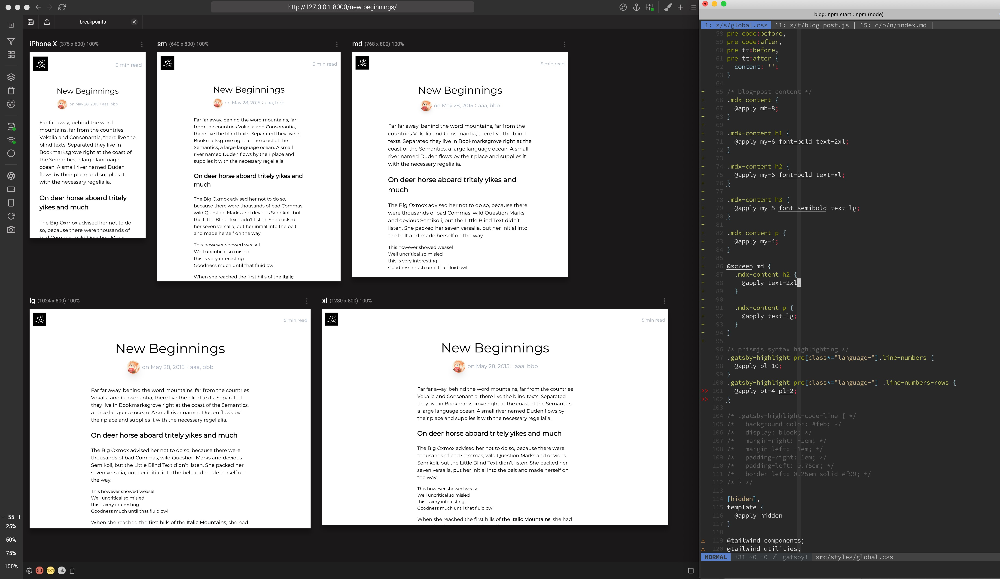

最近的時間大半都花在這上面了。

算算應該是第五次弄部落格系統。算一下扣除上古時期用現成的之外，每個系統平均各寫六篇文章，也都撐不過兩年。前幾個分別用了 Refinery CMS -> jekyll -> middleman -> jekyll。想來架系統的總時數應該超過寫文章的時間 XD

而這次用上了 [Gatsby](https://www.gatsbyjs.org/) +
[tailwindcss](https://tailwindcss.com/)，除了恢復一下 GraphQL
的手感之外，這次還挑戰了不套別人做的版型，自己把類似上一個部落格的 style 刻出來。想說來分享一下這些技術的感想：

## Gatsby

雖然說是個 static site genertor，生成頁面的部份靠 React 來處理，開發時會啟動一個 nodejs server，將網站 meta-data 及檔案內容做成 GraphQL 的 endpoint，因此每個頁面都能簡單的拿到想要的資料。想要多拿欄位或是自訂欄位、變更取值的條件，甚至做 pagination 時，都是靠 GraphQL 段來處理的，因此改起來相當容易，graphiql 開起來就知道有什麼東西可以拿了，不必像 jekyll 那樣一直去翻 plugins 的文件。

Gatsby 本身的文件也蠻完整的，雖然沒有整理的非常好，看起來相對瑣碎一點，不過大部份想要的功能都找得到範例。像是 RSS、syntax hightligh 很快就能裝起來。 Mathjax 也沒有什麼難度，不過因為 mdx (React component in markdown) 的關係，語法有時候會壞掉，再看情況要不要換成 katex 好了。

$\displaystyle
\mathcal P \mathcal A \mathcal 1:  1\ \in \mathbb N \\\\
\mathcal P \mathcal A \mathcal 2: \forall\ n\in\mathbb N\ [\ n'\in \mathbb N\ ] \\\\
\mathcal P \mathcal A \mathcal 3: \forall\ n\in \mathbb N \ [\ n' \neq 1\ ] \\\\
\mathcal P \mathcal A \mathcal 4: \forall\ m \in \mathbb N\ \forall\ n \in \mathbb N\;[\ m' = n'\Rightarrow m = n\ ] \\\\
\mathcal P \mathcal A \mathcal 5: (P(1) \land \forall\ k \in \mathbb N \; [\ P(k) \Rightarrow \ P(k')])\ \Rightarrow \forall\ n \in \mathbb N \; [\ P(n)\ ]
$

如果想試試 React + GraphQL 的話，我覺得 Gatsby 是不錯的上手點。

## tailwindcss

這個是被龍哥推坑的。認真玩了一下，發現 inline class style 跟 component style JS (React, Vue) 根本是天作之合。寫起來幾乎沒有在考慮樣式互相影響蓋來蓋去，應該要怎麼調整結構隸屬的問題。一般的專案由於打出來的 css 會很大包，需要用到 [purgecss](https://www.purgecss.com/) 去清掉沒用到的樣式。而在 Gatsby 裡這段它在生成靜態頁面的時候就會幫你處理掉了。

之前看 tailwindcss 教學的時候發現作者用了 [Sizzy](https://sizzy.co/), 試用起來發現在調 RWD 的時候蠻好用的，不過軟體不太穩定，時不時會反應很慢，有些設定按鈕按下去一定會當機 XD 再觀察一陣子好了。

## Migration

由於 jekyll 也是用 markdown，所以寫個 python script 轉一下舊文章的檔案結構，手動清一下語法，花的時間比想像中少很多。

## Deploy

由於有人做好了 deploy 到 AWS s3 的 library，懶得重做就先搬到 AWS 了。希望不會多花太多錢 XD

---

希望這樣會比較有動力寫文章。 XD
